# How To Git
This is some instructional fun with git and azure repos

# Required Set Up
## Installing Git
The following tools and libraries are required or just useful as indicated depending on your project. 
These are instructions for Windows, linux and mac usually have these tools installed.
* [Git](https://git-scm.com/downloads)(required) with the following options:  
  * `Add optional git tools to path`:  
  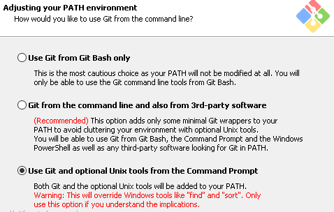
  * `Checkout Windows-style, commit Unix-style line endings`  
  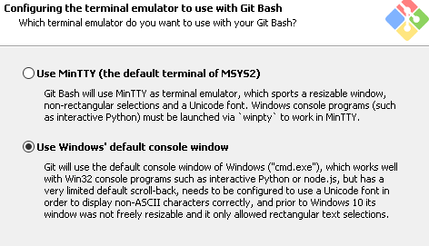
  * `Use Windows' default console window`  
  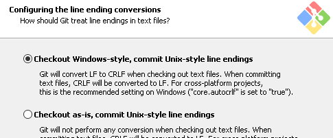
* [Chocolatey](https://chocolatey.org/install)(optional-windows only), make sure to install in an admin powershell instance
* make(optional-windows only), uses chocolatey to install with `choco install make`

## Post Install
After the tools are installed you will need to configure some of the settings.
### Git
If you have a org proxy, the proxy setting and your user name and email will need to be configured:
#### Proxy:
To configure Gits proxy settings run the following in a prompt:
```
git config --global http.proxy <your proxy here> 
```
#### User Name & Email
To configure the user name and email run the following in a prompt:
```
git config --global user.name "Firstname Lastname"
git config --global user.email "email@company.domain"
```

## IDE
You can use your IDE of choice, most modern IDE's have good git integration and allow you to do most of the git commands from the IDE.
You can do all git from the CLI which is recomended as it is generally much faster and easier in the long run.

## CLI
It is recommended to run git via a command line interface (CLI). The recommended CLIs are Windows Powershell or Git Bash. The latest Windows Powershell should be installed. The latest Windows Powershell is [Powershell 7](https://github.com/PowerShell/PowerShell/releases). If you are more comfortable with the Linux commands, then you might want to use Git Bash (which comes with the Git install).

## Starting
Basic use to clone the repo:

```
git clone <path to repo>
```

Some of the repositories **may** contain git submodules, to work with these use the clone command with the submodule checkout options:

To clone use:
```
git clone --recurse-submodules <path to repo> 
```

If you cloned with the plain `git clone <repo>` command, update the submodules with:
```
git submodule update --init --recursive
```

## Basic Workflow
This is the basic workflow for developing in all the repositories now on Azure Repos
To see the status, i.e. your current branch and state of files:  
`git status`
1. Checkout master `git checkout master`
1. Pull in latest changes `git pull`
1. Create a branch `git branch -b <feature/bug/fix>/<TicketNo.&|name>`
1. Be amazing
1. Add the amazing changes `git add <file> <file>`  
or all with `git add .` **<-- becareful with all as you may add files you don't want**
1. Commit the changes `git commit -m "<ticket-number>: my Amazing changes"`
1. Push the changes:
    * First time `git push -u origin <branchname>`
    * After first time `git push`
1. Create a Pull Request(PR) in Azure:
    1. Create a new PR:  
        
      or via the menu:  
      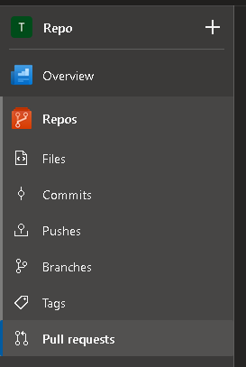  
      select **New pull request**:  
        
      select the branch:  
      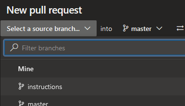  
    1. Make sure the branch you want to merge to is selected(usually `master`):  
      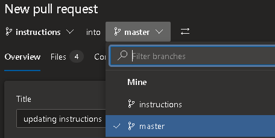  
    1. Fill in the details and add a reviewer(s) if required
    1. Click **Create**
1. Wait for build to pass:  
  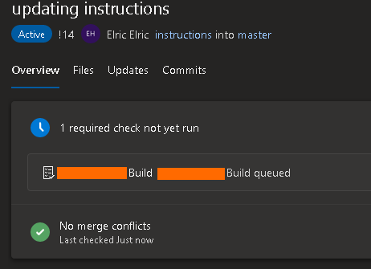  
1. When build passes:  
  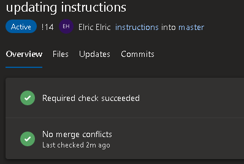  
1. Fix failing build/tests if any.  
Everytime you now push new changes the tests will re-run and you will get an e-mail notification if they pass/fail
1. If you have an approver they should mark it **Approved** with the correct approval:  
  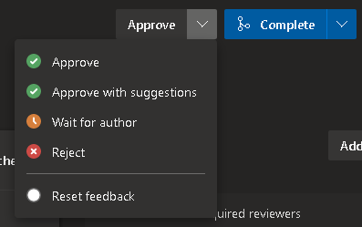
1. Complete/Merge the PR:
    1. Click **Complete**  
      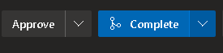
    1. Select Merge type
    The `Merge (no fast forward)` is a good safe default that will not change any of your commits.  
    The `Squash commit` will make all your commits in to one. You should select the `Customise merge commit message` and add the correct message if you choose this option:  
      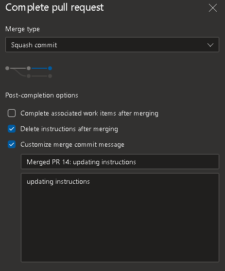
1. Delete remote branch (can be done in the above step):  
  The `Delete <branch> after merging` check box is good to use if you no long require this branch, after merging a branch you should delete it.  
  If you forget to delete it in the step you can delete it with the following command:
  ```
  git push --delete <branchname>
  ```
1. Delete your local branch:  
Deleting the remote branch does not delete you local branch, you have to do this manually, it is not required but good to keep things clean locally:
```
git branch -d <branchname>
```
If you used a squash commit or you just don't want the branch anymore you may get a warning message that branch is not merged with master, to force delete a branch use the big `-D` option:
```
git branch -D <branchname>
```
1. Repeat being awesome!

## Restrictions
Several restrictions have been put in place to make sure the integrity of the repository and code remains intact.

### Branching
Before you start woring on a fix or a feature, checkout the master branch and `git pull` the latest changes.

#### master:  
This branch contains the latest working code deployed to the environments.  
Merging with master can only occur through a pull request raised in Azure Repos.  
Pushing to the remote master will be rejected.

## Building locally with make
If Make is leverage for build/deploy/test tasks you should set some default make rules:
```
make help
```
To clean and build the package:
```
make clean
make build
```
But this one is up to you.

# Advanced Git
## Training
A great introduction to git is the following course: https://learngitbranching.js.org/

## Cheatsheet
Atlassian have made a good cheatsheet for common git commands:
https://www.atlassian.com/git/tutorials/atlassian-git-cheatsheet

## Deep Dive
If you want to go deep, a great resource to start with is: https://git-scm.com/book/en/v2

## See current status of my files
To view the current status of your branch use `git status`

## Change your commit message?
Sometimes we want/need to change the commit message, e.g. you forgot to add the ticket number in:  
```
git commit --amend
```
Your editor (default VIM) will show up and you can edit the message.

## Accidentally did your work on wrong branch? here is how to fix:
This will only work if you have not pushed your changes, if you have pushed your changes I recomend a quick web search for your specific use case.
Perform a soft reset then checkout a new branch and commit to the new branch
```
git reset --soft HEAD~1
```
make sure to create a new branch off the latest master:
```
git checkout master
git pull
```
Then create your new branch:
```
git checkout -b mynewbranch
git commit -m "My new feature"
```
**Note: the `~1` in the HEAD~1, this is saying you want to undo the last n=1 commits, if you made more commits just change this value, e.g.:  
You made 5 commits not yet pushed to the branch that you need to undo
```
git reset --soft HEAD~5
```

## Accidentally commited file?
Sometimes we do a `git add .` and we added files that we didn't want to or we just typed it wrong and added the wrong one.  
To fix this revert each file (or folder of files) with the following:
### Single file
```
git reset HEAD <file>
```

### Unstage a whole directory of file:
```
git reset HEAD <path/to/directory>
```

## I made a lot of commits that I want to squash?
When working on features you may often make several changes using a message like:  
`Trying to fix this again...`
To squish the last 5 commits up before you do a push to the remote:
```
git rebase -i HEAD~5
```
To find out how many commits you need to go back use the `git log` command, discussed below.  
To learn more about git rebase: https://git-scm.com/book/en/v2/Git-Branching-Rebasing

## Git Log
To view a list of commit you can run the `git log` command.  
This will produce a not very nice list, to make it pretty you can create an alias in git with a pretty log format:
```
git config --global alias.lg "log --color --graph --pretty=format:'%Cred%h%Creset -%C(yellow)%d%Creset %s %Cgreen(%cr) %C(bold blue)<%an>%Creset' --abbrev-commit"
```
Then to view a pretty log just type `git lg` instead of `git log`

### That's a lot of history!
To view only the last n commit add the following to the git log command `-n <number of commits>` e.g.:  
```
git log -n 5
```
# I've gone and message up, how to I reset my branch to the same as the remote repo?
Occasionally we want to discard everything we have done on a branch and start again from the latest version in the reop do:
```
git reset --hard origin/<branchname>
```
# Trouble-Shooting
* Make sure the latest software are installed.

* Sometimes you might get an occasional **proxy 407** error. This appears to be related to the VPN network access. You might need to reconnect the VPN or shutdown the CLI window.

* You might (or might not) need to set the user environment path variable, like below:
  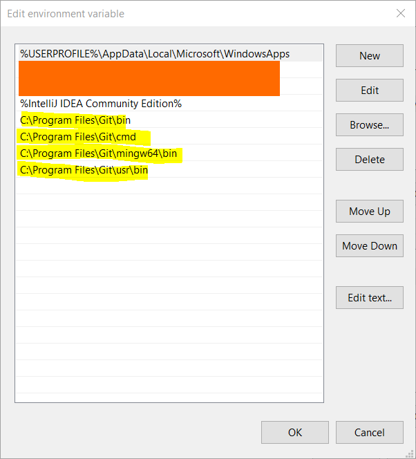

* If you encounter the following error related to proxy, it is probably due to the incorrect environment variable settings.
  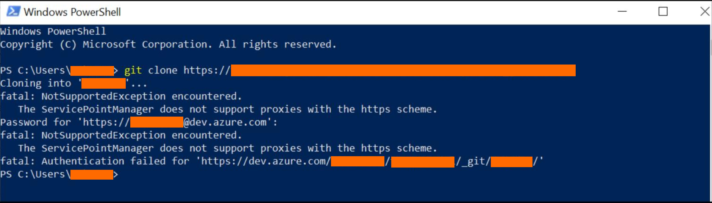
Check for the Windows environment variable:
```
http_proxy
https_proxy
proxy
```

* If you see the following dialog asking for credentials, the recommended one is to setup a personal access token (PAC) in Azure Dev Ops so it knows who you are.
  

  1. Go to the user settings in Auzre Dev Ops.
    

  1. Select `Personal access tokens` and create a new token.
    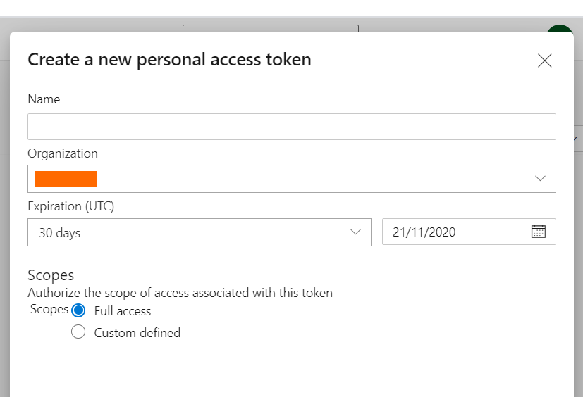

  1. Copy the token that was created and paste it to the credential managers window as the password.
